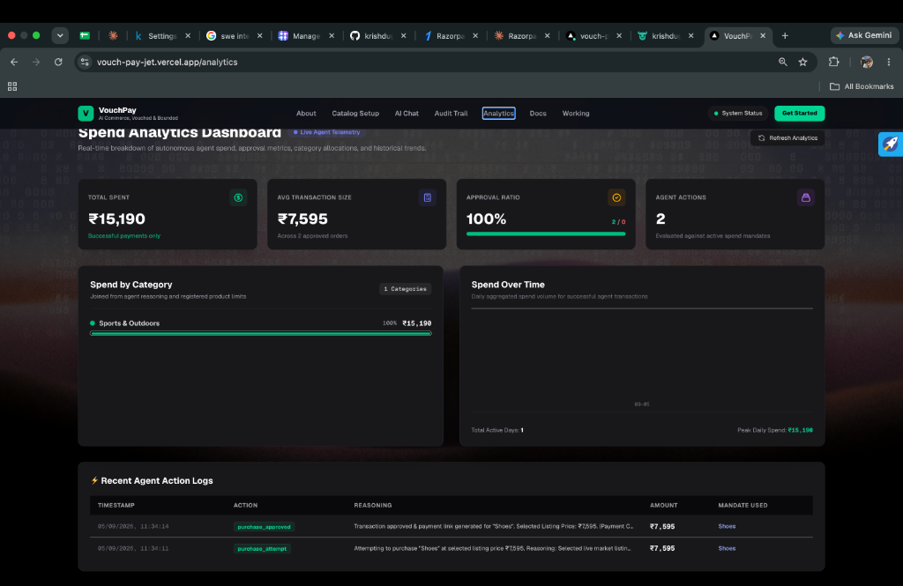
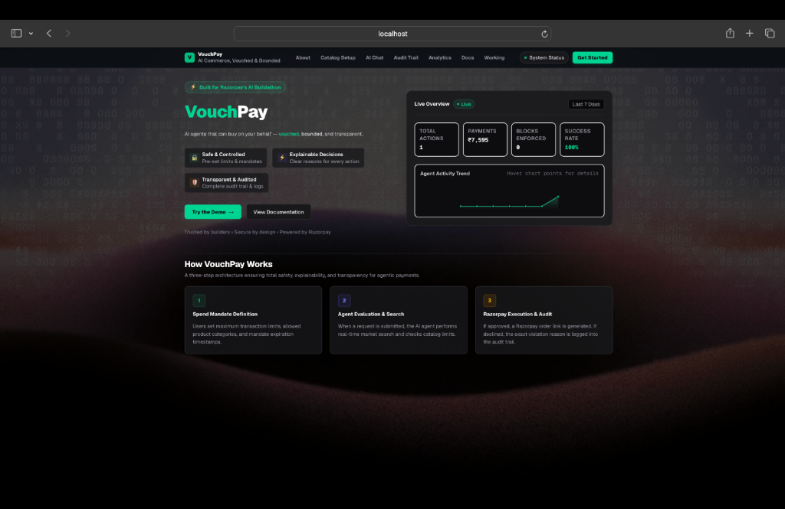
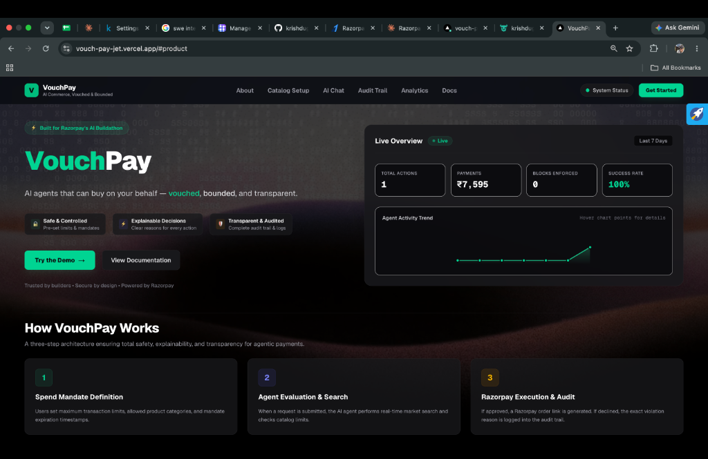
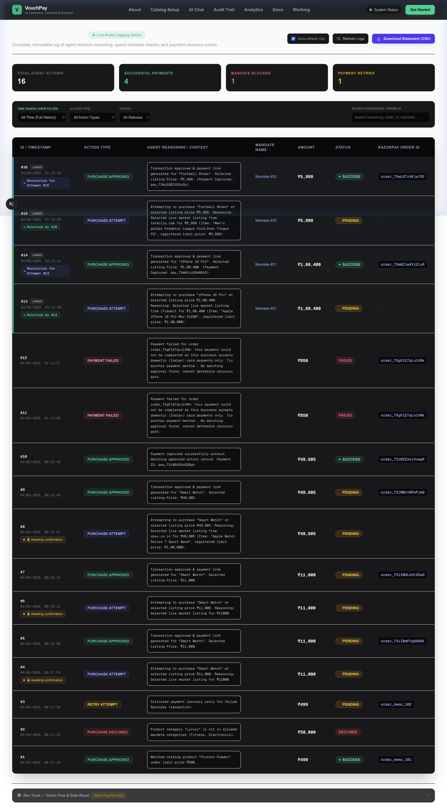

# VouchPay 🛒⚡
> **Track**: AI Growth & Agentic Commerce | **Hackathon**: Razorpay AI Buildathon 2026

VouchPay is an **agentic commerce infrastructure layer** that makes merchants transacting-ready for autonomous AI agents while giving consumers 100% financial safety and transparency. Every purchase initiated by an AI agent is bounded by user-defined **Spend Mandates**, validated in real time against merchant catalogs, logged in an explainable **Audit Trail**, and automatically recovered via **Razorpay Webhooks** if a payment fails.

Built with **Next.js 16 (App Router)**, **TypeScript**, **Tailwind CSS**, **Turso / LibSQL via `@libsql/client`**, **Razorpay Test Mode SDK**, and **Google Gemini 3.6 Flash**.

---

## 🖼️ Application Showcase & Interface Screenshots

### 1. Homepage & Live Telemetry Dashboard

*The VouchPay landing page features a dual-column hero layout with an interactive multi-tab showcase card. Visitors can view real-time telemetry metrics (total actions, payment volume, blocks enforced, 100% success rate, and 7-day SVG trend chart) or run an interactive in-browser AI agent simulator.*

---

### 2. Catalog & Spend Mandate Setup (`/catalog-setup`)

*The Catalog & Mandate Setup dashboard enables consumers to define explicit spending boundaries (`max_amount` up to ₹10,00,000, multi-select category permissions, and expiration dates) while merchants register product listings with maximum acceptable price limits.*

---

### 3. Bounded AI Agent Chat (`/chat`) — Mandate Bounds

*The natural language shopping interface displays active spend mandate bounds directly in the top header (e.g. `Shoes — ₹10,000 limit`). Consumers can select target mandates or click sample prompts (`buy me earphones under ₹1000`, `order me a protein shake under ₹500`, or `buy a luxury watch for ₹50,000`).*

---

### 4. Real-Time Market Search & Checkout Execution

*When a request is submitted, Google Gemini API performs real-time market search for matching products under the mandate limit, presenting live listings with thumbnails, price badges, merchant sources, and 1-click **Select & Purchase** Razorpay test checkout buttons.*

---

### 5. Explainable Audit Trail Dashboard (`/audit-trail`)

*The live Audit Trail dashboard streams system action logs in real time. Every decision is categorized (`PURCHASE ATTEMPT`, `PURCHASE APPROVED`, `PURCHASE DECLINED`, `RETRY ATTEMPT`, `RECOVERY ABANDONED`) and accompanied by plain-English reasoning detailing why an action was taken or blocked.*

---

## ⚡ Core Architecture & Key Features

### 1. Spend Mandate Engine (Financial Safety Boundaries)
- **Granular Controls**: Users define `max_amount` (spending cap), `allowed_categories` (e.g. `[\"Electronics\", \"Fitness\"]`), and `expires_at` timestamps.
- **Dual-Layer Validation Protocol**:
  1. **AI Reasoning Check**: Google Gemini (`gemini-3.6-flash` in strict `responseSchema` JSON mode) evaluates requests against active mandate rules.
  2. **Server-Side Enforcement**: `/api/checkout` re-verifies price limits and category permissions before generating any Razorpay order.

### 2. Autonomous Webhook Payment Failure Recovery
- **HMAC-SHA256 Security**: Integrates Razorpay Webhook listener (`/api/webhook`) with strict signature verification.
- **Automated Event Handling**:
  - **`payment.captured`**: Updates action status to `success` idempotently without double-counting.
  - **`payment.failed`**:
    - **Path A (Auto-Retry)**: Generates a new Razorpay order & payment link automatically if the mandate remains active.
    - **Path B (Re-authorization Block)**: Blocks retries if the mandate is expired or limits would be exceeded.
    - **Path C (Abandon Gracefully)**: Prevents infinite retry loops by abandoning after 1 failed retry attempt.

### 3. Serverless Hosted Database Layer (Turso / LibSQL)
- Powered by `@libsql/client` (LibSQL / Turso).
- Supports seamless async queries over HTTP/WebSockets in production on Vercel, while falling back gracefully to local SQLite (`file:db.sqlite`) in development.

---

## 🛠️ Tech Stack & Dependencies

| Layer | Technology | Purpose |
| :--- | :--- | :--- |
| **Framework** | Next.js 16 (App Router, Turbopack) | Serverless React Application Framework |
| **Language** | TypeScript | Strict static typing across API routes & components |
| **Styling** | Vanilla CSS / Tailwind CSS | Dark-mode visual aesthetic, glassmorphism, responsive grid |
| **Database** | `@libsql/client` (Turso LibSQL) | Serverless hosted SQLite database compatible with Vercel |
| **Payments** | Razorpay Node.js SDK | Sandbox Test Orders, Payment Links, Webhook signatures |
| **AI Model** | Google Gemini API (`gemini-3.6-flash`) | Natural language intent evaluation & structured JSON reasoning |

---

## 📋 Environment Configuration (`.env.local`)

Create a `.env.local` file in the workspace root with the following variables:

```env
# Razorpay Test Mode API Credentials (Razorpay Dashboard > Settings > API Keys)
RAZORPAY_KEY_ID=rzp_test_...
RAZORPAY_KEY_SECRET=your_razorpay_secret

# Razorpay Webhook Secret (Razorpay Dashboard > Webhooks)
RAZORPAY_WEBHOOK_SECRET=your_webhook_secret

# Google Gemini API Key (Google AI Studio)
GEMINI_API_KEY=your_gemini_api_key

# Hosted Database Credentials (Optional for local dev, Required for Vercel)
TURSO_DATABASE_URL=libsql://your-db.turso.io
TURSO_AUTH_TOKEN=your_turso_auth_token
```

---

## 🚀 Running Locally

1. **Clone repository & install dependencies**:
   ```bash
   git clone https://github.com/krishdugtal/VouchPay.git
   cd VouchPay
   npm install
   ```

2. **Start Next.js development server**:
   ```bash
   npm run dev
   ```
   Open `http://localhost:3000` (or `http://localhost:3001`) in your browser.

3. **(Optional) Test Webhooks with ngrok**:
   ```bash
   ngrok http 3000
   ```
   Set Webhook URL in Razorpay Dashboard to `https://<subdomain>.ngrok-free.app/api/webhook` and subscribe to `payment.captured` and `payment.failed`.

---

## 🧪 Judge Demo Walkthrough

1. **Configure Mandate & Catalog (`/catalog-setup`)**:
   - Register product: `Shoes` | Price: `₹7,595` | Category: `Sports & Outdoors`.
   - Set Spend Mandate: `Max Limit: ₹10,000` | Allowed: `Sports & Outdoors`, `Fitness` | Expiry: Future date.

2. **Test Bounded AI Shopping (`/chat`)**:
   - Select the `Shoes (₹10,000)` mandate pill.
   - Send: `"buy me Nike running shoes under 9999"`.
   - Observe **Gemini AI Approval**: Live market listings fetched via SerpAPI, displaying Razorpay checkout links.
   - Send: `"buy a luxury watch for ₹50,000"`.
   - Observe **Mandate Block**: Immediate decline with explicit reasoning (*Exceeds ₹10,000 spend cap*).

3. **Test Razorpay Sandbox Payment & Webhooks**:
   - Click **Select & Purchase** on an approved item.
   - Complete payment on Razorpay Sandbox popup (Netbanking / Cards).
   - Check `/audit-trail` to view live event transition to **SUCCESS**.

---

## 📄 License & Credits
Built for **Razorpay AI Buildathon 2026**. Powered by Razorpay, Google Gemini, Next.js, and Turso.
