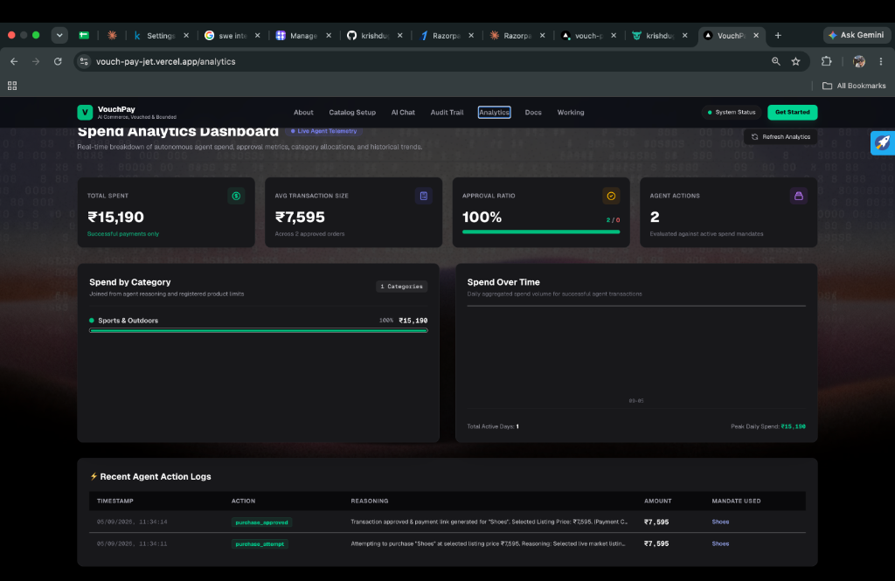
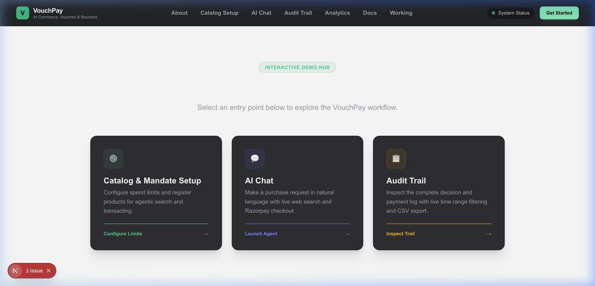
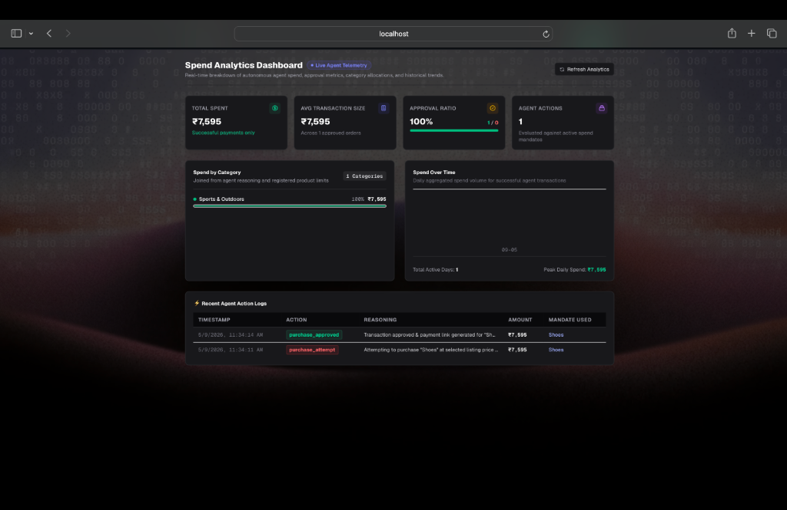
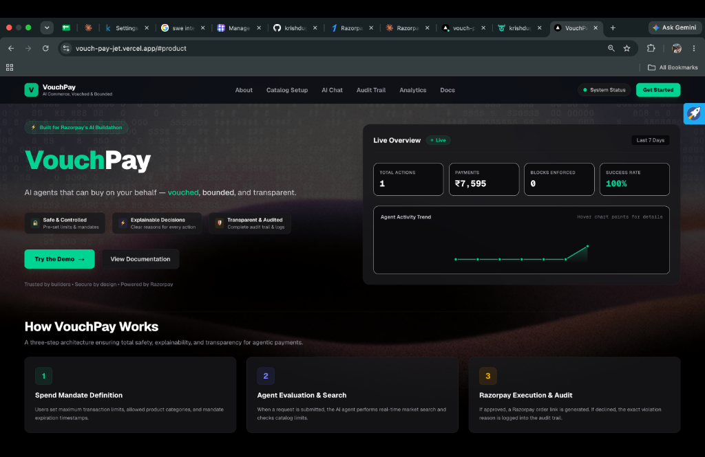
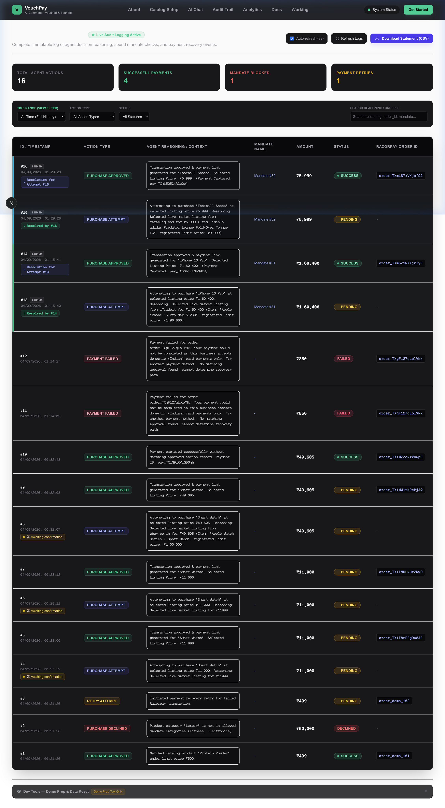

# VouchPay 🛒⚡
> **Track**: AI Growth & Agentic Commerce | **Hackathon**: Razorpay AI Buildathon 2026  
> 🌐 **Live Demo URL**: [https://vouch-pay-jet.vercel.app/](https://vouch-pay-jet.vercel.app/)

[](https://vouch-pay-jet.vercel.app/)
[](https://nextjs.org/)
[](https://www.typescriptlang.org/)
[](https://razorpay.com/)
[](https://ai.google.dev/)
[](https://turso.tech/)
[](LICENSE)

VouchPay is an **agentic commerce financial governance and payment execution infrastructure layer**. It makes merchants transacting-ready for autonomous AI agents while guaranteeing consumers 100% financial control, safety, and transparency.

Every commercial transaction initiated by an AI agent is bounded by user-defined **Spend Mandates**, validated in real time against live market listings and merchant catalog ceilings, logged in an explainable **Audit Trail**, and automatically recovered via **Razorpay Webhooks** if a payment fails.

---

## 📋 Table of Contents

- [🎯 Problem Statement & Solution](#-problem-statement--solution)
- [🖥️ Application Modules & Pages](#️-application-modules--pages)
- [🏗️ System Architecture & Workflow](#️-system-architecture--workflow)
- [⚡ Core System Features](#-core-system-features)
- [📊 Database Schema Architecture](#-database-schema-architecture)
- [📡 Complete API Reference](#-complete-api-reference)
- [🔒 Security & Production Isolation](#-security--production-isolation)
- [📋 Environment Configuration](#-environment-configuration)
- [🚀 Quickstart & Local Installation](#-quickstart--local-installation)
- [🧪 Testing & Verification Suite](#-testing--verification-suite)
- [🏆 Hackathon Judge Demo Protocol](#-hackathon-judge-demo-protocol)
- [📄 License & Hackathon Credits](#-license--hackathon-credits)

---

## 🎯 Problem Statement & Solution

### The Challenge in Agentic Commerce
As AI agents transition from text-generating chatbots to autonomous actors performing real-world transactions, two critical bottlenecks emerge:

1. **Unbounded Financial Risk**: Consumers cannot safely delegate payment credentials to AI agents without strict spending caps, category restrictions, and expiration timestamps.
2. **Checkout Friction & Silent Failures**: Automated payments frequently fail due to bank timeouts, card declines, or missing parameters, leaving agents stranded without recovery logic.
3. **Black-Box Decisioning**: Existing agent frameworks execute payments without explainable logs, making it impossible for consumers or merchants to audit why an action was approved or blocked.

### The VouchPay Solution
VouchPay establishes a **Dual-Layer Verification Protocol** and an **Autonomous Webhook State Machine**:

- **Spend Mandates**: Users define explicit spending limits (`max_amount`), category permissions (`allowed_categories`), and expiration timestamps (`expires_at`).
- **Dual-Layer Validation**:
  - *Layer 1*: Google Gemini AI (`gemini-3.6-flash` in strict `responseSchema` JSON mode) evaluates purchase prompts against mandate rules.
  - *Layer 2*: Serverless API guardrails re-verify price limits before invoking the Razorpay Orders SDK.
- **Autonomous Failure Recovery**: Razorpay webhooks signed with HMAC-SHA256 automatically attempt payment retries under active mandates or abandon gracefully without human intervention.
- **Explainable Audit Trail**: Every approval, decline, retry, or abandonment is recorded in real time with plain-English mathematical justifications.

---

## 🖥️ Application Modules & Pages

### 1. VouchPay's Homepage (`/`)

*High-impact landing portal featuring real-time system telemetry metrics, a 7-day agent activity trend graph, live infrastructure status indicators, and an interactive in-browser AI agent simulator.*

---

### 2. Interactive Demo Hub & Workflow Selector (`/demo`)

*Central entry hub allowing users and hackathon judges to launch into any module of the application—including Mandate Configuration, Bounded AI Agent Chat, or the Audit Trail.*

---

### 3. Catalog & Mandate Setup (`/catalog-setup`)

*Financial governance control panel where consumers define active spend mandates (spending limits up to ₹10,00,000, category permissions, and expiration dates) and merchants register catalog listings with price ceilings.*

---

### 4. AI Agent Chat (`/chat`)

*Bounded conversational commerce interface powered by Google Gemini 3.6 Flash and SerpAPI, where AI agents parse natural language purchase prompts, search live market listings, enforce active spend mandates, and generate 1-click Razorpay test payment links.*

---

### 5. Audit Trail (`/audit-trail`)

*Real-time immutable event log dashboard streaming plain-English reasoning, transaction IDs, payment capture statuses, filterable time ranges, and automated webhook recovery retries.*

---

## 🏗️ System Architecture & Workflow

```
                                  ┌───────────────────────────┐
                                  │      User / Consumer      │
                                  └─────────────┬─────────────┘
                                                │
                                                ▼
                                  ┌───────────────────────────┐
                                  │   Configure Spend Mandate │
                                  │ (max_amount, categories)  │
                                  └─────────────┬─────────────┘
                                                │
                                                ▼
                                  ┌───────────────────────────┐
                                  │  Bounded AI Chat (/chat)  │
                                  └─────────────┬─────────────┘
                                                │
                                                ▼
                                  ┌───────────────────────────┐
                                  │  Google Gemini 3.6 Flash  │
                                  │   + SerpAPI Live Search   │
                                  └─────────────┬─────────────┘
                                                │
                                                ▼
                               ┌─────────────────────────────────┐
                               │ Dual-Layer Compliance Guardrail │
                               └────────────────┬────────────────┘
                                                │
                       ┌────────────────────────┴────────────────────────┐
                       ▼                                                 ▼
            [ Within Mandate Rules ]                         [ Mandate Limits Breached ]
                       │                                                 │
                       ▼                                                 ▼
           ┌──────────────────────┐                          ┌──────────────────────┐
           │ Generate Razorpay    │                          │ Log Decline Reason   │
           │ Sandbox Payment Link │                          │ in Audit Trail       │
           └───────────┬──────────┘                          └──────────────────────┘
                       │
                       ▼
           ┌────────────────────────────────────────────────────────┐
           │        Razorpay Webhook Receiver (/api/webhook)        │
           │           (HMAC-SHA256 Signature Verified)             │
           └───────────┬────────────────────────────────┬───────────┘
                       │                                │
                       ▼                                ▼
            [ payment.captured ]                     [ payment.failed ]
                       │                                │
                       ▼                                ▼
            ┌─────────────────────┐          ┌──────────────────────┐
            │ Log Success         │          │ Recovery Engine      │
            │ (Single-Counting)   │          │ (Auto-Retry / Block) │
            └─────────────────────┘          └──────────────────────┘
```

---

## ⚡ Core System Features

### 1. Spend Mandate Engine (`/catalog-setup`)
- **Granular Controls**: Configure maximum spending caps (up to ₹10,00,000), allowed product categories (`Electronics`, `Fitness`, `Clothing`, `Software`, `Books`, etc.), and mandate expiration dates.
- **Catalog Price Ceilings**: Merchants register product catalog items with maximum acceptable price limits.
- **Dynamic Mandate Switching**: Interactive mandate selector pills on `/chat` allow testing purchase requests against different active budgets in real time.

### 2. Bounded Autonomous Shopping Agent (`/chat` & `/api/agent`)
- **Natural Language Parsing**: Evaluates user shopping prompts against the currently selected spend mandate.
- **Real-Time Market Search**: Integrates SerpAPI Google Shopping search to fetch live listing prices, merchant sources, and thumbnail images.
- **1-Click Razorpay Checkout**: Directly generates short-url Razorpay Sandbox payment links inside chat bubbles upon mandate approval.

### 3. Autonomous Webhook Payment Failure Recovery (`/api/webhook`)
- **HMAC-SHA256 Signature Verification**: Rejects unauthenticated incoming webhook requests by verifying `x-razorpay-signature` against `RAZORPAY_WEBHOOK_SECRET`.
- **Three-Branch Failure Recovery State Machine**:
  - **Branch A (Auto-Retry)**: Automatically generates a new Razorpay order & payment link if the payment fails under an active, valid spend mandate.
  - **Branch B (Re-authorization Block)**: Blocks retry generation if the mandate has expired or if retrying would exceed the spend cap.
  - **Branch C (Abandon Gracefully)**: Prevents infinite retry loops by abandoning recovery after 1 failed retry attempt.

### 4. Transparent Audit Trail & Telemetry (`/audit-trail` & `/analytics`)
- **Real-Time Log Stream**: Polled live feed displaying action types (`PURCHASE ATTEMPT`, `PURCHASE APPROVED`, `PURCHASE DECLINED`, `RETRY ATTEMPT`, `RECOVERY ABANDONED`, `SYSTEM ERROR`).
- **Explainable Plain-English Reasoning**: Every log entry details the exact mathematical and categorical reasoning behind the agent's decision.
- **Deduplicated Spend Metrics**: Spend calculations strictly sum captured payments (`purchase_approved` or `retry_attempt` with `status = 'success'`), preventing double-counting against `purchase_attempt` records.

### 5. Serverless Hosted Database Core (Turso / LibSQL)
- Built with `@libsql/client` (Turso LibSQL).
- Communicates asynchronously over HTTP/WebSockets in production on Vercel, while falling back gracefully to local SQLite (`file:db.sqlite`) in development.

---

## 📊 Database Schema Architecture

The database consists of three primary tables designed for auditability and serverless execution:

```sql
-- 1. Mandates Table
CREATE TABLE IF NOT EXISTS mandates (
  id INTEGER PRIMARY KEY AUTOINCREMENT,
  name TEXT DEFAULT 'Default Mandate',
  max_amount REAL NOT NULL,
  allowed_categories TEXT NOT NULL, -- JSON array e.g. ["Electronics", "Fitness"]
  expires_at DATETIME NOT NULL,
  created_at DATETIME DEFAULT CURRENT_TIMESTAMP
);

-- 2. Products Table
CREATE TABLE IF NOT EXISTS products (
  id INTEGER PRIMARY KEY AUTOINCREMENT,
  name TEXT NOT NULL,
  max_price REAL NOT NULL,
  category TEXT NOT NULL,
  created_at DATETIME DEFAULT CURRENT_TIMESTAMP
);

-- 3. Agent Actions Table (Audit Trail Logs)
CREATE TABLE IF NOT EXISTS agent_actions (
  id INTEGER PRIMARY KEY AUTOINCREMENT,
  mandate_id INTEGER,
  transaction_group_id TEXT,
  action_type TEXT NOT NULL, -- purchase_attempt, purchase_approved, purchase_declined, retry_attempt, recovery_abandoned
  reasoning TEXT NOT NULL,
  amount REAL NOT NULL,
  status TEXT DEFAULT 'pending', -- pending, completed, success, failed
  razorpay_order_id TEXT,
  timestamp DATETIME DEFAULT CURRENT_TIMESTAMP,
  FOREIGN KEY (mandate_id) REFERENCES mandates (id)
);
```

---

## 📡 Complete API Reference

### 1. `POST /api/agent` — AI Decision Engine
Evaluates a purchase request against a target spend mandate using Google Gemini 3.6 Flash.

- **URL**: `/api/agent`
- **Method**: `POST`
- **Headers**: `Content-Type: application/json`

**Request Body:**
```json
{
  "message": "buy Nike running shoes under 10000",
  "mandate_id": 1
}
```

**Response (200 OK — Approved):**
```json
{
  "success": true,
  "decision": {
    "action": "purchase",
    "product_id": 2,
    "amount": 7595,
    "reasoning": "Product price ₹7,595 fits within the ₹10,000 mandate limit and category 'Sports & Outdoors' is permitted."
  }
}
```

**Response (200 OK — Declined):**
```json
{
  "success": true,
  "decision": {
    "action": "decline",
    "product_id": null,
    "amount": 50000,
    "reasoning": "Transaction blocked: Product price (₹50,000) exceeds active mandate limit (₹10,000)."
  }
}
```

---

### 2. `POST /api/checkout` — Payment Link Generator
Enforces server-side mandate checks and creates a Razorpay Test Mode Order & Payment Link.

- **URL**: `/api/checkout`
- **Method**: `POST`
- **Headers**: `Content-Type: application/json`

**Request Body:**
```json
{
  "mandate_id": 1,
  "product_id": 2,
  "amount": 7595,
  "reasoning": "Nike Winflo 12 running shoes within sports mandate limit"
}
```

**Response (200 OK):**
```json
{
  "success": true,
  "order_id": "order_TYLB5Z1MAIo5RK",
  "payment_link_url": "https://rzp.io/i/..."
}
```

---

### 3. `POST /api/webhook` — Razorpay Webhook Event Receiver
Handles incoming payment callbacks with HMAC-SHA256 signature verification.

- **URL**: `/api/webhook`
- **Method**: `POST`
- **Headers**: `x-razorpay-signature: <hmac-sha256-signature>`

**Processed Events:**
- `payment.captured`: Updates matching transaction log to `status = 'success'` idempotently.
- `payment.failed`: Triggers failure recovery logic (Auto-retry, Re-authorization block, or Abandonment).

---

### 4. `GET /api/audit` — Audit Log Stream
Returns the audit trail actions sorted chronologically.

- **URL**: `/api/audit`
- **Method**: `GET`

**Response (200 OK):**
```json
{
  "success": true,
  "actions": [
    {
      "id": 2,
      "mandate_id": 1,
      "mandate_name": "Shoes Mandate",
      "action_type": "purchase_approved",
      "reasoning": "Transaction approved & payment link generated for \"Shoes\". Selected Listing Price: ₹7,595.",
      "amount": 7595,
      "status": "success",
      "razorpay_order_id": "order_TYLB5Z1MAIo5RK",
      "timestamp": "2026-09-05 11:34:14"
    }
  ]
}
```

---

### 5. `GET /api/analytics` — Telemetry & Metrics
Returns aggregated spend metrics and 7-day activity metrics.

- **URL**: `/api/analytics`
- **Method**: `GET`

**Response (200 OK):**
```json
{
  "success": true,
  "data": {
    "totalSpent": 7595,
    "successfulCount": 1,
    "declinedCount": 0,
    "totalDecisions": 1,
    "approvalRate": 100,
    "avgTransactionSize": 7595,
    "activity7Days": [
      { "date": "2026-09-05", "label": "Sep 5", "count": 1, "amount": 7595 }
    ]
  }
}
```

---

## 🔒 Security & Production Isolation

1. **Zero Secret Leakage**: `RAZORPAY_KEY_SECRET`, `RAZORPAY_WEBHOOK_SECRET`, and `GEMINI_API_KEY` reside exclusively in server-side environment variables (`.env.local` / Vercel Environment Variables). They are never exposed to client bundles.
2. **Webhook Signature Authentication**: All webhook calls are verified via HMAC-SHA256 signature matching. Requests with invalid or missing signatures are immediately rejected with `400 Bad Request`.
3. **Database Parameterization**: All SQL queries use prepared statement parameters (`?`) via `@libsql/client` to prevent SQL injection vulnerabilities.
4. **Idempotent Callbacks**: Payment completion handlers prevent duplicate event updates from inflating financial metrics.

---

## 📋 Environment Configuration

Create a `.env.local` file in the workspace root with the following variables:

```env
# Razorpay Test Mode API Credentials (Razorpay Dashboard > Settings > API Keys)
RAZORPAY_KEY_ID=rzp_test_...
RAZORPAY_KEY_SECRET=your_razorpay_secret

# Razorpay Webhook Secret (Razorpay Dashboard > Webhooks)
RAZORPAY_WEBHOOK_SECRET=your_webhook_secret

# Google Gemini API Key (Google AI Studio)
GEMINI_API_KEY=your_gemini_api_key

# SerpAPI Key for Live Market Product Search (SerpAPI Dashboard)
SERPAPI_API_KEY=your_serpapi_key

# Hosted Database Credentials (Required for Vercel deployment)
TURSO_DATABASE_URL=libsql://your-db.turso.io
TURSO_AUTH_TOKEN=your_turso_auth_token
```

> **Security Note**: `.env.local` is listed in `.gitignore` and must never be committed to source control.

---

## 🚀 Quickstart & Local Installation

### 1. Clone & Install Dependencies
```bash
git clone https://github.com/krishdugtal/VouchPay.git
cd VouchPay
npm install
```

### 2. Configure Environment Variables
Create `.env.local` as shown in the section above.

### 3. Start Development Server
```bash
npm run dev
```
Open `http://localhost:3000` (or `http://localhost:3001`) in your browser.

### 4. Build Compilation Check
```bash
npm run build
```

---

## 🧪 Testing & Verification Suite

VouchPay includes automated node scripts to verify database operations, mandate enforcement, and webhook failure recovery:

1. **Verify Turso / LibSQL Async Database Core**:
   ```bash
   node scratch/test_db_migration.js
   ```
2. **Verify Mandate Rules & Budget Enforcement**:
   ```bash
   node scratch/test_budget_enforcement.js
   ```
3. **Verify Webhook Failure & Auto-Retry Recovery Engine**:
   ```bash
   node scratch/test_webhook_failed.js
   ```

---

## 🏆 Hackathon Judge Demo Protocol

Follow this 4-step sequence to test VouchPay during judge evaluation:

1. **Step 1: Define Mandate & Catalog Ceiling (`/catalog-setup`)**
   - Register product: `Shoes` | Price: `₹7,595` | Category: `Sports & Outdoors`.
   - Configure Mandate: `Max Limit: ₹10,000` | Allowed: `Sports & Outdoors`, `Fitness` | Expiration: Future date.

2. **Step 2: Test AI Agent Reasoning (`/chat`)**
   - Select the active `Shoes (₹10,000)` mandate pill.
   - Send: `"buy me Nike running shoes under 9999"`.
   - Observe **AI Approval**: Live SerpAPI market listings rendered with Razorpay checkout link buttons.
   - Send: `"buy a luxury watch for ₹50,000"`.
   - Observe **Mandate Block**: Immediate decline with explicit reasoning (*Exceeds ₹10,000 budget cap*).

3. **Step 3: Test Payment Execution & Webhooks**
   - Click **Select & Purchase** on an approved item.
   - Complete payment on the Razorpay Sandbox popup (Netbanking / Cards).
   - Check `/audit-trail` to verify live event status transition to **SUCCESS**.

4. **Step 4: Inspect Telemetry & Audit Logs (`/analytics` & `/audit-trail`)**
   - Inspect aggregated spend metrics, 100% approval ratio, and plain-English audit reasoning logs.

---

## 📄 License & Hackathon Credits

Built with ❤️ for **Razorpay AI Buildathon 2026**.

- **Author**: Krishved Singh Dugtal
- **Repository**: [https://github.com/krishdugtal/VouchPay.git](https://github.com/krishdugtal/VouchPay.git)
- **License**: MIT License
